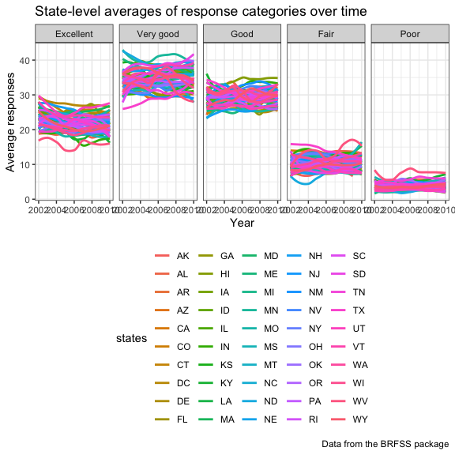

Homework 3
================
Aakriti Gupta
2018-10-14

**Problem 1**
-------------

### Reading and cleaning the dataset

-   Importing the BRFSS dataset from p8105.datasets.
-   Cleaning variable names
-   Focusing on the topic "Overall Health"
-   Formatted the data to keep only the useful variables
-   Arranged reponses ordered from Excellent to Poor

``` r
library(p8105.datasets)
data(brfss_smart2010)
```

``` r
brfss = brfss_smart2010 %>% 
  janitor::clean_names() %>% 
  filter(topic == "Overall Health") %>% 
  select(-class, -topic, -question, -sample_size, -(confidence_limit_low:geo_location)) %>% 
    mutate(response = fct_relevel(response, c("Excellent", "Very good", "Good", "Fair", "Poor"))) %>%
  arrange(response)
```

### Answering questions using the cleaned dataset

-   Question 1: In 2002, which states were observed at 7 locations?

``` r
brfss %>% 
  filter(year == 2002) %>% 
  group_by(locationabbr) %>% 
  summarise(location_count = n_distinct(locationdesc)) %>%
  filter(location_count == 7) %>% 
  knitr::kable(digits = 1)
```

| locationabbr |  location\_count|
|:-------------|----------------:|
| CT           |                7|
| FL           |                7|
| NC           |                7|

In the year 2002, **3 states namely Connecticut, Florida and North Carolina**, were observed at 7 locations.

-   Question 2: Make a “spaghetti plot” that shows the number of locations in each state from 2002 to 2010.

``` r
knitr::opts_chunk$set(
  fig.width = 6,
  fig.asp = 1.0,
  out.width = "90%"
)
theme_set(theme_bw() + theme(legend.position = "right"))

brfss %>%
  group_by(year, locationabbr) %>% 
  summarise(location_count = n_distinct(locationdesc)) %>%
  rename(states = locationabbr) %>% 
  ggplot(aes(x = year, y = location_count)) + geom_smooth(aes(color = states), se = FALSE) + 
  labs(
    title = "Number of locations in each state from 2002 to 2010",
    x = "Year",
    y = "Number of distinct locations",
    caption = "Data from the BRFSS package"
  )
```

    ## `geom_smooth()` using method = 'loess' and formula 'y ~ x'


-   Question 3: Make a table showing, for the years 2002, 2006, and 2010, the mean and standard deviation of the proportion of “Excellent” responses across locations in NY State.

-   Question 4: For each year and state, compute the average proportion in each response category (taking the average across locations in a state). Make a five-panel plot that shows, for each response category separately, the distribution of these state-level averages over time.

``` r
knitr::opts_chunk$set(
  fig.width = 6,
  fig.asp = .6,
  out.width = "90%"
)

theme_set(theme_bw() + theme(legend.position = "bottom"))

brfss %>% 
  group_by(year, locationabbr, response) %>% 
  summarise(avg_response = mean(data_value)) %>% 
  rename(states = locationabbr) %>% 
  ggplot(aes(x = year, y = avg_response)) + geom_smooth(aes(color = states), se = FALSE) + 
  facet_grid(. ~ response) +
  labs(
    title = "State-level averages of response categories over time",
    x = "Year",
    y = "Average responses",
    caption = "Data from the BRFSS package"
  )
```

    ## `geom_smooth()` using method = 'loess' and formula 'y ~ x'

    ## Warning: Removed 21 rows containing non-finite values (stat_smooth).

    ## Warning in simpleLoess(y, x, w, span, degree = degree, parametric =
    ## parametric, : pseudoinverse used at 2004

    ## Warning in simpleLoess(y, x, w, span, degree = degree, parametric =
    ## parametric, : neighborhood radius 2

    ## Warning in simpleLoess(y, x, w, span, degree = degree, parametric =
    ## parametric, : reciprocal condition number 0

    ## Warning in simpleLoess(y, x, w, span, degree = degree, parametric =
    ## parametric, : There are other near singularities as well. 4



**Problem 2**
-------------

### Reading and cleaning the dataset

``` r
library(p8105.datasets)
data(instacart)

insta = instacart %>% 
  janitor::clean_names()
```

### Summarizing the dataset

We will examine the instacart dataset. Instacart is an online grocery service that allows you to shop online from local stores.This dataset has 1384617 observations and 15 variables. The variables `aisle`, `department`, `eval_set` and `product_name` are of class `character`, whereas all remaining variables are of class `integer`.

### Answering questions

-   Question 1: How many aisles are there, and which aisles are the most items ordered from?

**There are 134 aisles in this dataset**.

Most items are ordered from **aisle 24 for fresh fruits and aisle 123 for packaged vegetables fruits** as seen below.

``` r
insta %>% 
  group_by(product_id, aisle_id, aisle) %>% 
 count() %>% 
  arrange(desc(n)) %>% 
  head() %>% 
  knitr::kable()
```

|  product\_id|  aisle\_id| aisle                      |      n|
|------------:|----------:|:---------------------------|------:|
|        24852|         24| fresh fruits               |  18726|
|        13176|         24| fresh fruits               |  15480|
|        21137|         24| fresh fruits               |  10894|
|        21903|        123| packaged vegetables fruits |   9784|
|        47626|         24| fresh fruits               |   8135|
|        47766|         24| fresh fruits               |   7409|
