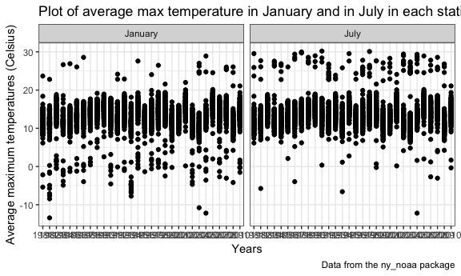

Homework 3
================
Aakriti Gupta
2018-10-14

**Problem 1**
-------------

### Reading and cleaning the dataset

-   Importing the BRFSS dataset from p8105.datasets.
-   Cleaning variable names
-   Focusing on the topic "Overall Health"
-   Formatted the data to keep only the useful variables
-   Arranged reponses ordered from Excellent to Poor

``` r
library(p8105.datasets)
data(brfss_smart2010)
```

``` r
brfss = brfss_smart2010 %>% 
  janitor::clean_names() %>% 
  filter(topic == "Overall Health") %>% 
  select(-class, -topic, -question, -sample_size, -(confidence_limit_low:geo_location)) %>% 
    mutate(response = fct_relevel(response, c("Excellent", "Very good", "Good", "Fair", "Poor"))) %>%
  arrange(response)
```

### Answering questions using the cleaned dataset

-   Question 1: In 2002, which states were observed at 7 locations?

``` r
brfss %>% 
  filter(year == 2002) %>% 
  group_by(locationabbr) %>% 
  summarise(location_count = n_distinct(locationdesc)) %>%
  filter(location_count == 7) %>% 
  knitr::kable(digits = 1)
```

| locationabbr |  location\_count|
|:-------------|----------------:|
| CT           |                7|
| FL           |                7|
| NC           |                7|

In the year 2002, **3 states namely Connecticut, Florida and North Carolina**, were observed at 7 locations.

-   Question 2: Make a “spaghetti plot” that shows the number of locations in each state from 2002 to 2010.

``` r
knitr::opts_chunk$set(
  fig.width = 6,
  fig.asp = 1.0,
  out.width = "90%"
)
theme_set(theme_bw() + theme(legend.position = "right"))

brfss %>%
  group_by(year, locationabbr) %>% 
  summarise(location_count = n_distinct(locationdesc)) %>%
  rename(states = locationabbr) %>% 
  ggplot(aes(x = year, y = location_count)) + geom_smooth(aes(color = states), se = FALSE) + 
  labs(
    title = "Number of locations in each state from 2002 to 2010",
    x = "Year",
    y = "Number of distinct locations",
    caption = "Data from the BRFSS package"
  )
```

    ## `geom_smooth()` using method = 'loess' and formula 'y ~ x'


-   Question 3: Make a table showing, for the years 2002, 2006, and 2010, the mean and standard deviation of the proportion of “Excellent” responses across locations in NY State.

``` r
brfss %>% 
  mutate(year = as.character(year)) %>% 
  filter(year %in% c("2002", "2006", "2010") & locationabbr == "NY" & response == "Excellent") %>% 
  group_by(year) %>% 
  summarise(mean_excellent = mean(data_value), sd_excellent = sd(data_value)) %>% 
  knitr::kable()
```

| year |  mean\_excellent|  sd\_excellent|
|:-----|----------------:|--------------:|
| 2002 |         24.04000|       4.486424|
| 2006 |         22.53333|       4.000833|
| 2010 |         22.70000|       3.567212|

-   Question 4: For each year and state, compute the average proportion in each response category (taking the average across locations in a state). Make a five-panel plot that shows, for each response category separately, the distribution of these state-level averages over time.

``` r
knitr::opts_chunk$set(
  fig.width = 6,
  fig.asp = .6,
  out.width = "90%"
)

theme_set(theme_bw() + theme(legend.position = "bottom"))

brfss %>% 
  group_by(year, locationabbr, response) %>% 
  summarise(avg_response = mean(data_value)) %>% 
  rename(states = locationabbr) %>% 
  ggplot(aes(x = year, y = avg_response)) + geom_smooth(aes(color = states), se = FALSE) + 
  facet_grid(. ~ response) +
  labs(
    title = "State-level averages of response categories over time",
    x = "Year",
    y = "Average responses",
    caption = "Data from the BRFSS package"
  )
```

    ## `geom_smooth()` using method = 'loess' and formula 'y ~ x'

    ## Warning: Removed 21 rows containing non-finite values (stat_smooth).

    ## Warning in simpleLoess(y, x, w, span, degree = degree, parametric =
    ## parametric, : pseudoinverse used at 2004

    ## Warning in simpleLoess(y, x, w, span, degree = degree, parametric =
    ## parametric, : neighborhood radius 2

    ## Warning in simpleLoess(y, x, w, span, degree = degree, parametric =
    ## parametric, : reciprocal condition number 0

    ## Warning in simpleLoess(y, x, w, span, degree = degree, parametric =
    ## parametric, : There are other near singularities as well. 4


**Problem 2**
-------------

### Reading and cleaning the dataset

``` r
library(p8105.datasets)
data(instacart)

insta = instacart %>% 
  janitor::clean_names()
```

### Summarizing the dataset

We will examine the instacart dataset. Instacart is an online grocery service that allows you to shop online from local stores.This dataset has 1384617 observations and 15 variables. The variables `aisle`, `department`, `eval_set` and `product_name` are of class `character`, whereas all remaining variables are of class `integer`.

### Answering questions

-   Question 1: How many aisles are there, and which aisles are the most items ordered from?

**There are 134 aisles in this dataset**.

Most items are ordered from **aisle 83 for fresh vegetables, aisle 24 for fresh fruits and aisle 123 for packaged vegetables fruits** as seen below.

``` r
insta %>%
  group_by(aisle_id, aisle) %>% 
  summarise(item_count = n()) %>% 
  arrange(item_count) %>% 
  tail(3) %>% 
  knitr::kable()
```

|  aisle\_id| aisle                      |  item\_count|
|----------:|:---------------------------|------------:|
|        123| packaged vegetables fruits |        78493|
|         24| fresh fruits               |       150473|
|         83| fresh vegetables           |       150609|

-   Question 2: Make a plot that shows the number of items ordered in each aisle. Order aisles sensibly, and organize your plot so others can read it.

``` r
knitr::opts_chunk$set(
  fig.width = 6,
  fig.asp = 0.6,
  out.width = "90%"
)
theme_set(theme_bw() + theme(legend.position = "bottom"))

insta %>%
  group_by(aisle_id, aisle) %>% 
  summarise(item_count = n()) %>%
  ggplot(aes(x = aisle_id, y = item_count)) + geom_point(color = "blue") + 
  labs(
    title = "Plot of number of items ordered in each aisle",
    x = "Aisle ID",
    y = "Number of items ordered",
    caption = "Data from the instacart package"
  ) +
   geom_text(aes(label = ifelse(item_count > 35000, as.character(aisle),'')), hjust = 1.1, vjust = 1.1)
```


-   Question 3: Make a table showing the most popular item in each of the aisles “baking ingredients”, “dog food care”, and “packaged vegetables fruits”.

The table for the most popular items in these aisles is as follows:

``` r
insta %>% 
  filter(aisle %in% c("baking ingredients", "dog food care", "packaged vegetables fruits")) %>% 
  group_by(aisle, product_name) %>% 
  summarise(product_count = n()) %>%
  filter(product_count == max(product_count)) %>% 
  select(-product_count) %>% 
  knitr::kable()
```

| aisle                      | product\_name                                 |
|:---------------------------|:----------------------------------------------|
| baking ingredients         | Light Brown Sugar                             |
| dog food care              | Snack Sticks Chicken & Rice Recipe Dog Treats |
| packaged vegetables fruits | Organic Baby Spinach                          |

-   Question 4: Make a table showing the mean hour of the day at which Pink Lady Apples and Coffee Ice Cream are ordered on each day of the week; format this table for human readers (i.e. produce a 2 x 7 table).

Assuming 0 stands for Sunday, 1 for Monday, and so on...

``` r
insta %>% 
  filter(product_name %in% c("Pink Lady Apples", "Coffee Ice Cream")) %>% 
  group_by(product_name, order_dow) %>%
  mutate(mean_hour = mean(order_hour_of_day)) %>% 
  select(product_name, order_dow, mean_hour) %>%
  distinct() %>%  
  spread(key = order_dow, value = mean_hour) %>% 
  rename(Product = product_name, Sunday = "0", Monday = "1", Tuesday = "2", Wednesday = "3", Thursday = "4", Friday = "5", Saturday = "6") %>% 
  knitr::kable()
```

| Product          |    Sunday|    Monday|   Tuesday|  Wednesday|  Thursday|    Friday|  Saturday|
|:-----------------|---------:|---------:|---------:|----------:|---------:|---------:|---------:|
| Coffee Ice Cream |  13.77419|  14.31579|  15.38095|   15.31818|  15.21739|  12.26316|  13.83333|
| Pink Lady Apples |  13.44118|  11.36000|  11.70213|   14.25000|  11.55172|  12.78431|  11.93750|

**Problem 3**
-------------

### Reading the dataset

``` r
library(p8105.datasets)
data(ny_noaa)
```

### Summarizing the dataset

We will examine the ny\_noaa dataset. This dataset has 2595176 observations and 7 variables. The variables `id`, `tmax`and `tmin` are of class `character`, whereas `prcp`, `snow` and `snwd` are of class `integer`.

The variables represent the following:

-   id: Weather station ID
-   date: Date of observation
-   prcp: Precipitation (tenths of mm)
-   snow: Snowfall (mm)
-   snwd: Snow depth (mm)
-   tmax: Maximum temperature (tenths of degrees C)
-   tmin: Minimum temperature (tenths of degrees C)

There appear to be significant missing values for the variables `tmax`, `tmin`, `prcp`, `snow` and `snwd`.

``` r
skimr::skim(ny_noaa)
```

    ## Skim summary statistics
    ##  n obs: 2595176 
    ##  n variables: 7 
    ## 
    ## ── Variable type:character ────────────────────────────────────────────────────────────────────────
    ##  variable missing complete       n min max empty n_unique
    ##        id       0  2595176 2595176  11  11     0      747
    ##      tmax 1134358  1460818 2595176   1   4     0      532
    ##      tmin 1134420  1460756 2595176   1   4     0      548
    ## 
    ## ── Variable type:Date ─────────────────────────────────────────────────────────────────────────────
    ##  variable missing complete       n        min        max     median
    ##      date       0  2595176 2595176 1981-01-01 2010-12-31 1997-01-21
    ##  n_unique
    ##     10957
    ## 
    ## ── Variable type:integer ──────────────────────────────────────────────────────────────────────────
    ##  variable missing complete       n  mean     sd  p0 p25 p50 p75  p100
    ##      prcp  145838  2449338 2595176 29.82  78.18   0   0   0  23 22860
    ##      snow  381221  2213955 2595176  4.99  27.22 -13   0   0   0 10160
    ##      snwd  591786  2003390 2595176 37.31 113.54   0   0   0   0  9195
    ##      hist
    ##  ▇▁▁▁▁▁▁▁
    ##  ▇▁▁▁▁▁▁▁
    ##  ▇▁▁▁▁▁▁▁

Cleaning the dataset and answering questions
--------------------------------------------

-   Question 1: Do some data cleaning. Create separate variables for year, month, and day. Ensure observations for temperature, precipitation, and snowfall are given in reasonable units. For snowfall, what are the most commonly observed values? Why?

``` r
noaa = ny_noaa %>% 
  janitor::clean_names() %>% 
  separate(date, into = c("year", "month", "day"), sep = "-") %>% 
  mutate(
    prcp = prcp / 10,
    tmin = as.integer(tmin) / 10,
    tmax = as.integer(tmax) / 10
    ) 
```

-   Added variables for year, month, and day based on the date
-   Changed units for prcp, tmin and tmax as they were in the tenths of the desired units. Also changed tmin and tmax to integers before dividing by 10.
-   *Most commonly observed values for snowfall are 0 because there is no snowfall on most days of the year.*

-   Question 2 Make a two-panel plot showing the average max temperature in January and in July in each station across years. Is there any observable / interpretable structure? Any outliers?

``` r
knitr::opts_chunk$set(
  fig.width = 6,
  fig.asp = 0.6,
  out.width = "90%"
)
theme_set(theme_bw() + theme(legend.position = "bottom"))

noaa %>% 
  group_by(year, id) %>% 
  filter(month %in% c("01", "07")) %>% 
  mutate(mean_tmax = mean(tmax, na.rm = TRUE), month = recode(month, "01" = "January", "07" = "July")) %>% 
  select(year, id, month, mean_tmax) %>% 
  distinct() %>% 
  ggplot(aes(x = year, y = mean_tmax)) + geom_point() + 
  facet_grid(. ~ month) + 
  labs(
    title = "Plot of average max temperature in January and in July in each station across years",
    x = "Years",
    y = "Average maximum temperatures (Celsius)",
    caption = "Data from the ny_noaa package"
  ) 
```

    ## Warning: Removed 5935 rows containing missing values (geom_point).



In this 2-panel plot, the average maximum temperatures across majority of the stations are within a 10 degree celsius range. There are outlier stations that have average maximum temperatures much higher or lower than the rest of the stations.

-   Question 3. Make a two-panel plot showing (i) tmax vs tmin for the full dataset (note that a scatterplot may not be the best option); and (ii) make a plot showing the distribution of snowfall values greater than 0 and less than 100 separately by year.

``` r
knitr::opts_chunk$set(
  fig.width = 6,
  fig.asp = 0.6,
  out.width = "90%"
)

tmax_tmin_density = noaa %>% 
  ggplot( aes(x = tmax, y = tmin)) + stat_density_2d(aes(fill = ..level..), geom = "polygon", colour = "white")

snow_year_ridges = noaa %>% 
  filter(snow %in% 1:99) %>% 
  ggplot(aes(x = snow, y = year)) + geom_density_ridges(scale = 0.85)

tmax_tmin_density + snow_year_ridges
```

    ## Warning: Removed 1136276 rows containing non-finite values
    ## (stat_density2d).

    ## Picking joint bandwidth of 3.76


For the plot for tmax versus tmin, given the large dataset, I used density\_2d function with contouring to get a better sense of the distribution.

For the plot of snowfall by year, I created a density\_ridges plot.
